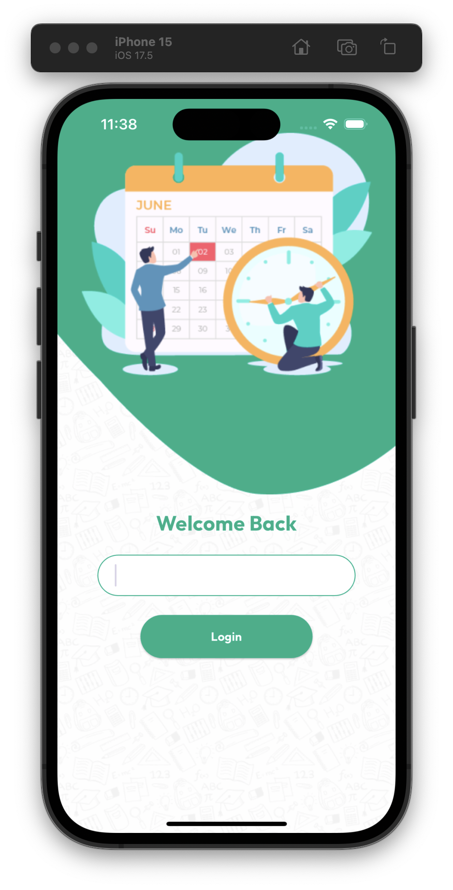
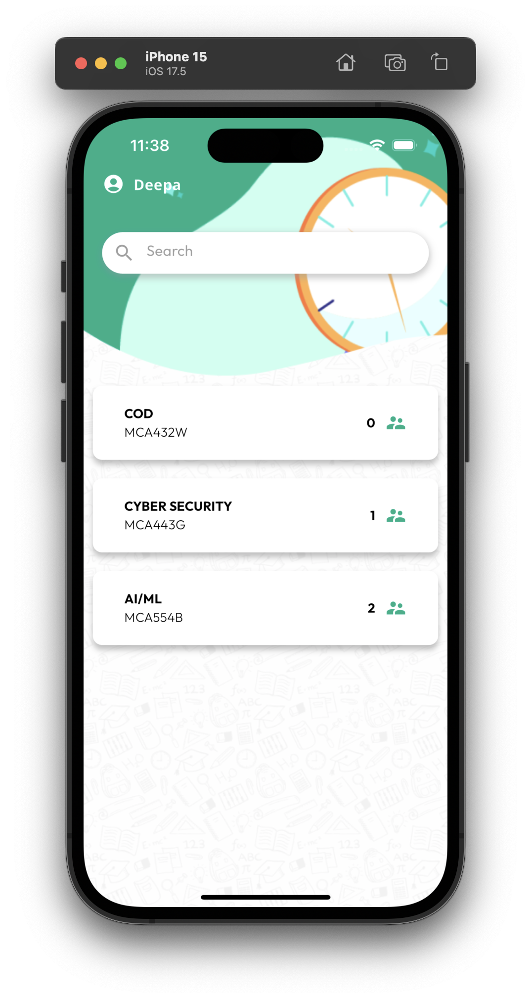
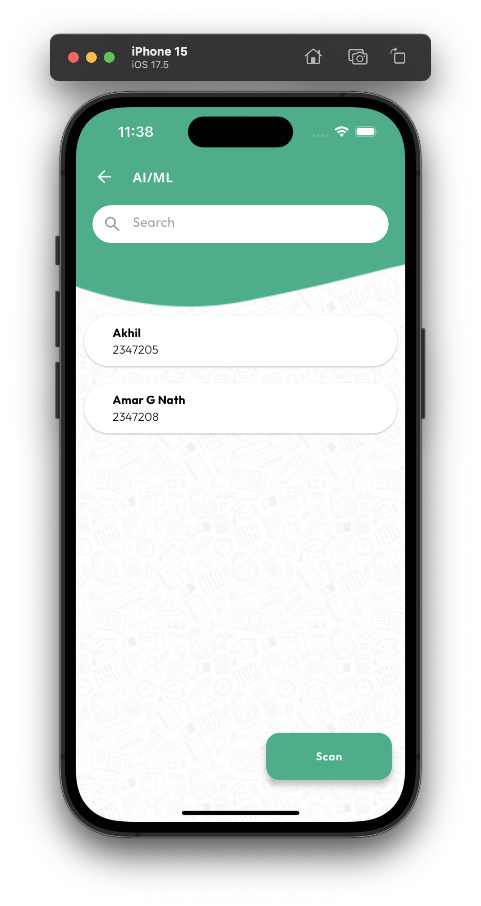
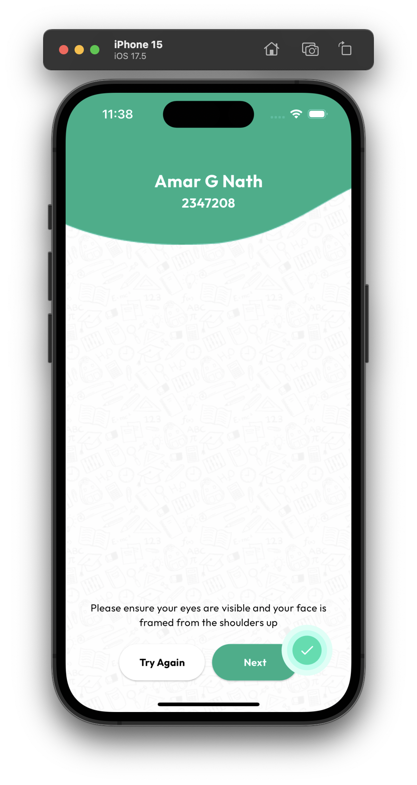
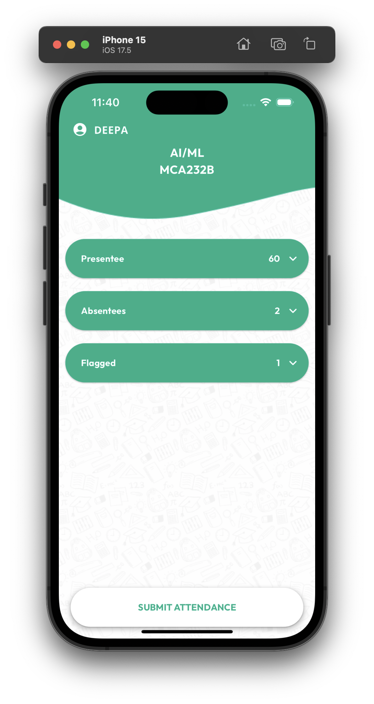

# GroomGuard Attendance

The GroomGuard Attendance is a revolutionary mobile application designed to streamline the attendance procedure in educational institutions by addressing common issues such as proxy attendance, time wastage, and grooming code enforcement. Utilizing facial biometric recognition technology, this app ensures accurate and efficient attendance recording, eliminating the possibility of students marking attendance for absent friends. Additionally, it enforces grooming standards to promote professionalism and discipline among students.

## Features

### For Teachers and Administrators
- **Secure Login**: Teachers log in using a secure PIN code and face recognition.
- **Class Selection**: Teachers can select their class and pass the mobile device to students for attendance marking.
- **Attendance Lock**: During attendance, the app locks to prevent misuse, allowing access only to attendance functionality.
- **Grooming Standards Enforcement**: The app flags students not adhering to grooming standards automatically.
- **Override Facility**: Teachers can review and override flagged students' attendance securely.

### For Administrators
- **Web-based Portal**: Administrators have access to a web-based portal for comprehensive data management.
- **Attendance Records**: View and control attendance records of students and teachers.
- **Compliance Reports**: Generate and access compliance reports to maintain high grooming standards.
- **Data Security**: Ensures that only authorized personnel can access the system's data.

## Benefits
- **Saves Valuable Class Time**: Streamlined attendance process.
- **Accurate Attendance Records**: Eliminates proxy attendance.
- **Maintains High Grooming Standards**: Encourages professionalism and discipline.
- **Organized and Disciplined Environment**: Leads to a more organized educational environment.

## Screenshots
- **Teacher Login**  
  

- **Class Selection**  
  

- **Student List**  
  

- **Scanning Screen**  
  

- **Attendance Report**  
  

## Contributors

- **Amar G Nath**
- **Ashwin Joshy**
- **Vishnu Swaroop P S**
