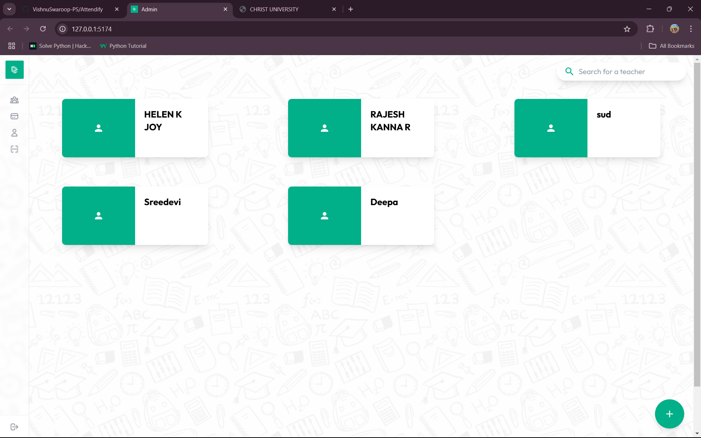
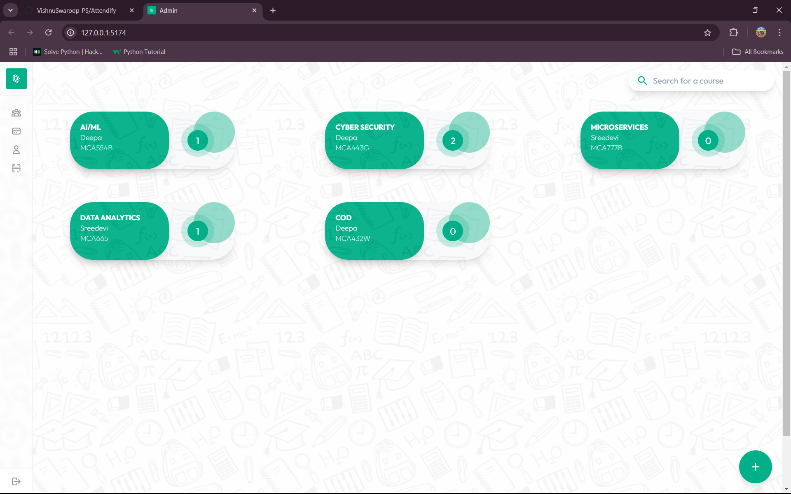
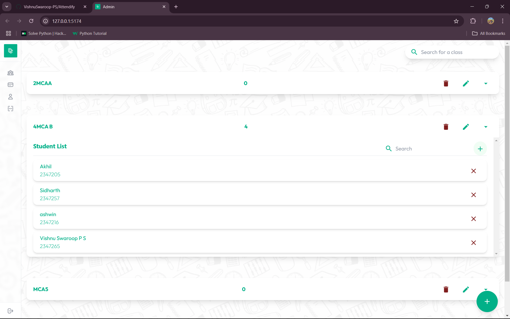

# Attendify   

Attendify is a smart, efficient, and real-time attendance management system that leverages facial recognition to simplify attendance tracking. The app provides a user-friendly interface for teachers, students, and administrators, making the entire process seamless and accurate.  
 
## Features  

1. **Facial Recognition**: Processes live images and matches them with stored data.  
2. **Data Management**: Handles CRUD operations for teachers, courses, classes, and students in Firebase.  
3. **Real-Time Updates**: Provides live attendance tracking with instant updates.  
  

## How It Works  

### Workflow  
1. **Adding Teachers and Courses**  
   - Begin by adding teacher details on the Teachers Page.  
   - Create courses and assign the teachers to the courses on the Courses Page.  
2. **Setting Up Classes**  
   - Add a class and populate it with students.  
   - For each student, input their details and capture a live photo.  
3. **Real-Time Attendance**  
   - Navigate to the Scanning Page.  
   - Use the live camera feed to scan faces.  
   - The system compares scanned faces with stored data and marks attendance for recognized students.  


## Screenshots  

### 1. Teachers Page  


### 2. Courses Page  


### 3. Classes Page  


### 4. Scanning Page  


## Tech Stack  

- **Frontend**: React js  
- **Backend Framework**: Flask  
- **Database**: Firebase (Firestore) 
- **Facial Recognition**: Dlib library for Python  

## Installation  

### Backend  
### Prerequisites  

Ensure you have the following installed:  
- Python 3.7 or higher  
- pip (Python Package Manager)  
- Firebase account with a Firestore database set up  

### Steps  

1. **Clone the Repository**  
   ```bash  
   git clone https://github.com/VishnuSwaroop-PS/Attendify  

2.	Navigate to the Project Directory
    ```bash
    cd attendify/backend
    ```

3.	Install Dependencies
    ```bash
    pip install -r requirements.txt  
    ```
5.	Run the Server
    ```bash
    python app.py  
    ```
### Frontend  
### Prerequisites  
Ensure you have the following installed:  
- Node.js  
- npm (Node Package Manager)  
- A modern browser (for React app testing)  

### Steps  
1. Clone this repository:  
   ```bash  
   git clone https://github.com/VishnuSwaroop-PS/Attendify  
    ```
2.	Navigate to the project directory:
    ```bash
    cd attendify/admin  
    ```

3.	Install dependencies:
    ```bash
    npm i
    npm i axios react-webcam firebase
    ```
4.	Start the development server:
    ```bash
    npm run dev
    ```

Future Scope

1.	Integration with cloud storage for scalable data management.
2.	Adding advanced analytics for attendance insights and trends.
3.	Implementing role-based access for administrators, teachers, and students.

Contact

If you have any questions or feedback, feel free to reach out!

-	Name: Vishnu Swaroop p s
-	LinkedIn: [Vishnu Swaroop P S](https://www.linkedin.com/in/vishnu-swaroop-p-s/)


